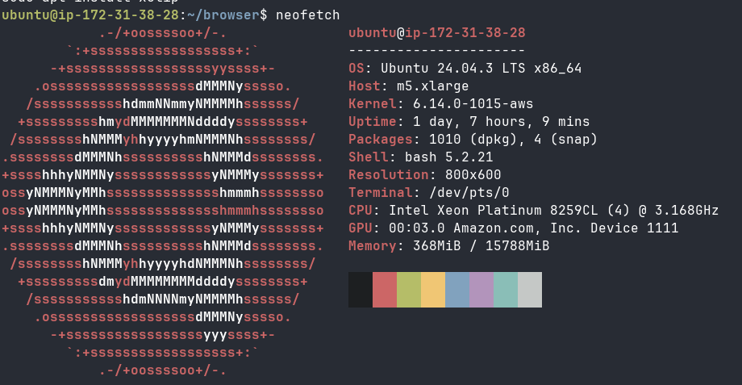
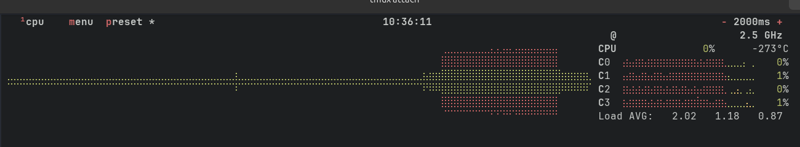
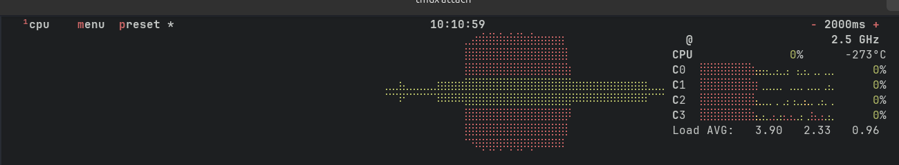

# Benchmarks

We all love benchmarks but we know it's difficult to do fair comparisons.
That's why it's important to be very transparent about the protocol of the benchmark.

# Crawler Benchmark

## Methodology

The benchmark uses [Amiibo](https://demo-browser.lightpanda.io/amiibo/) demo website.
The program will crawl the first page and then all the subpages to retrieve 933
URLs in total.

The crawler program is written in Go, is uses
[chromedp](https://github.com/chromedp/chromedp) lib to control the browsers.
The source code is available in [chromedp/crawler/](./chromedp/crawler).

This benchmark will get the pages through internet connexion.

Measuring memory and CPU usage is not easy. Chrome uses many threads.
We use `smem` for memory which take shared memory pages into account.
We use `ps` for CPU utilization.

We run the follwing script with `watch -n0.1` during the benchmark to get stats
every 100ms. And we take the peak memory with its CPU percent in account.

```bash
#!/bin/sh

PROGRAM=$1

MEM=`smem -c "pss" -P "^$PROGRAM" -t -k | tail -1`
CPU=`ps aux | grep $PROGRAM | grep -v grep | awk '{sum+=$3} END {print "Total CPU: " sum "%"}'`

echo "$MEM\t$CPU"
```

## Preparation

### Test machine

The tests are run in an AWS m5.xlarge (x86_64) with a fresh Ubuntu install.



### Browsers

We use Google Chrome version 143.0.7499.109

```console
$ google-chrome-stable --version
Google Chrome 143.0.7499.109
```
And Lightpanda commit [68e9d3b9ea560d1c01e4c4aa0008f3ff01a0b564](https://github.com/lightpanda-io/browser/commit/68e9d3b9ea560d1c01e4c4aa0008f3ff01a0b564).

### Crawler

Clone the [demo repository](https://github.com/lightpanda-io/demo).

We use a Go program to crawl the website.

```console
$ cd chromedp
$ go build -o crawler crawler/main.go
$ ./crawler/main https://demo-browser.lightpanda.io/amiibo/
```

## Summary

| Bench | duration | memory peak | % CPU | Pages |
|--|--|--|--|--|
| Lightpanda 1 process | 0:49.17 | 126.2M | 3.4% | 933 |
| Lightpanda 2 process | 0:22.86 | 145.7M | 15.2% | 933 |
| Lightpanda 5 process | 0:10.29 | 165.7M | 34.8% | 933 |
| Lightpanda 10 process | 0:05.32 | 203.9M | 72.3% | 933 |
| Lightpanda 25 process | 0:02.72 | 305.5M | 170.8% | 933 |
| Lightpanda 100 process | 0:03.66 | 740.9M | 239.4% | 933 |
| Chrome 1 tab | 1:15.46 | 1.2G | 125.5% | 933 |
| Chrome 2 tabs | 0:42.79 | 1.3G | 194.9% | 933 |
| Chrome 5 tabs | 0:35.58 | 1.4G | 203.2% | 933 |
| Chrome 10 tabs | 0:37.86 | 1.7G | 233.3% | 933 |
| Chrome 25 tabs | 0:38.85 | 2.1G | 193% | 933 |
| Chrome 100 tabs | 0:57.90 | 4.4G | 209.3% | 933 |

## Single tab/process

Run the crawler with one tab for Chrome and one process for Lightpanda.

### Chrome

Start Chrome on port 9222.
It displays the websocket connection URL to use.

```
$ rm -fr /tmp/bench_chrome; \
        /opt/google/chrome/chrome --headless=new --remote-debugging-port=9222 --user-data-dir=/tmp/bench_chrome
```

```
$ /usr/bin/time -v ./crawler/main --pool 1 --cdp ws://127.0.0.1:9222/devtools/browser/46425034-faf3-40e4-8b00-55224d96ecc2  https://demo-browser.lightpanda.io/amiibo/

        Command being timed: "./crawler/main --pool 1 --cdp ws://127.0.0.1:9222/devtools/browser/46425034-faf3-40e4-8b00-55224d96ecc2  https://demo-browser.lightpanda.io/amiibo/"
        User time (seconds): 4.68
        System time (seconds): 2.93
        Percent of CPU this job got: 10%
        Elapsed (wall clock) time (h:mm:ss or m:ss): 1:15.46
        Average shared text size (kbytes): 0
        Average unshared data size (kbytes): 0
        Average stack size (kbytes): 0
        Average total size (kbytes): 0
        Maximum resident set size (kbytes): 16116
        Average resident set size (kbytes): 0
        Major (requiring I/O) page faults: 0
        Minor (reclaiming a frame) page faults: 6007
        Voluntary context switches: 259587
        Involuntary context switches: 33023
        Swaps: 0
        File system inputs: 0
        File system outputs: 0
        Socket messages sent: 0
        Socket messages received: 0
        Signals delivered: 0
        Page size (bytes): 4096
        Exit status: 0
```



### Lightpanda

```
$ ./zig-out/bin/lightpanda serve
```

```
$ /usr/bin/time -v ./crawler/main --pool 1 https://demo-browser.lightpanda.io/amiibo/

        Command being timed: "./crawler/main --pool 1 https://demo-browser.lightpanda.io/amiibo/"
        User time (securls=933onds): 2.17
        System time (seconds): 1.21
        Percent of CPU this job got: 6%
        Elapsed (wall clock) time (h:mm:ss or m:ss): 0:49.17
        Average shared text size (kbytes): 0
        Average unshared data size (kbytes): 0
        Average stack size (kbytes): 0
        Average total size (kbytes): 0
        Maximum resident set size (kbytes): 16256
        Average resident set size (kbytes): 0
        Major (requiring I/O) page faults: 0
        Minor (reclaiming a frame) page faults: 4989
        Voluntary context switches: 117774
        Involuntary context switches: 1436
        Swaps: 0
        File system inputs: 0
        File system outputs: 0
        Socket messages sent: 0
        Socket messages received: 0
        Signals delivered: 0
        Page size (bytes): 4096
        Exit status: 0
```


## Multi tabs/processes

### Chrome

Start Chrome on port 9222.
It displays the websocket connection URL to use.

```
$ rm -fr /tmp/bench_chrome; \
        /opt/google/chrome/chrome --headless=new \
        --remote-debugging-port=9222 --user-data-dir=/tmp/bench_chrome
```

```
$ /usr/bin/time -v ./crawler/main --pool 100 \
        --cdp ws://127.0.0.1:9222/devtools/browser/4443644c-c476-4597-bd59-cf7ad38ec226 \
        https://demo-browser.lightpanda.io/amiibo/

        Command being timed: "./crawler/main --pool 100 --cdp ws://127.0.0.1:9222/devtools/browser/4443644c-c476-4597-bd59-cf7ad38ec226 https://demo-browser.lightpanda.io/amiibo/"
        User time (seconds): 8.10
        System time (seconds): 4.40
        Percent of CPU this job got: 21%
        Elapsed (wall clock) time (h:mm:ss or m:ss): 0:57.90
        Average shared text size (kbytes): 0
        Average unshared data size (kbytes): 0
        Average stack size (kbytes): 0
        Average total size (kbytes): 0
        Maximum resident set size (kbytes): 45916
        Average resident set size (kbytes): 0
        Major (requiring I/O) page faults: 0
        Minor (reclaiming a frame) page faults: 14227
        Voluntary context switches: 392700
        Involuntary context switches: 84661
        Swaps: 0
        File system inputs: 0
        File system outputs: 0
        Socket messages sent: 0
        Socket messages received: 0
        Signals delivered: 0
        Page size (bytes): 4096
        Exit status: 0
```




### Lightpanda

Lightpanda can't create multi-tabs. So instead we start 100 browser process,
each on it's own port. The crawler program has `-fork` and `-lpd-path` options
to enable this mode.

```
$ /usr/bin/time -v ./crawler/main --pool 100 -fork \
        --lpd-path ../../browser/zig-out/bin/lightpanda \
        https://demo-browser.lightpanda.io/amiibo/

        Command being timed: "./crawler/main --pool 100 --fork --lpd-path ../../browser/zig-out/bin/lightpanda https://demo-browser.lightpanda.io/amiibo/"
        User time (seconds): 9.12
        System time (seconds): 2.30
        Percent of CPU this job got: 311%
        Elapsed (wall clock) time (h:mm:ss or m:ss): 0:03.66
        Average shared text size (kbytes): 0
        Average unshared data size (kbytes): 0
        Average stack size (kbytes): 0
        Average total size (kbytes): 0
        Maximum resident set size (kbytes): 47308
        Average resident set size (kbytes): 0
        Major (requiring I/O) page faults: 0
        Minor (reclaiming a frame) page faults: 255945
        Voluntary context switches: 23807
        Involuntary context switches: 12692
        Swaps: 0
        File system inputs: 0
        File system outputs: 0
        Socket messages sent: 0
        Socket messages received: 0
        Signals delivered: 0
        Page size (bytes): 4096
        Exit status: 0
```

# Campfire e-commerce Benchmark

## Methodology

The benchmark uses a [homemade demo web page](https://demo-browser.lightpanda.io/campfire-commerce/).
This web page is a fake e-commerce product offer page loading product details
and reviews in JSON with two XHR requests.

We decided to use a homemade page because Lightpanda browser is not yet fully
compliant and we wanted to be sure it would be able to execute the web page
correctly to be comparable with Google Chrome.

Moreover, using this web page allows us to run the test with a local web server,
reducing network request impacts to the bench.

### Metrics and tools

We compare now multiple page loads and js evaluations using
[Puppeteer](https://https://pptr.dev/), which connects to the browser using CDP
(Chrome Debug Protocol).

We run the follwing script with `watch -n0.1` during the benchmark to get stats
every 100ms. And we take the peak memory with its CPU percent in account.

```bash
#!/bin/sh

PROGRAM=$1

MEM=`smem -c "pss" -P "^$PROGRAM" -t -k | tail -1`
CPU=`ps aux | grep $PROGRAM | grep -v grep | awk '{sum+=$3} END {print "Total CPU: " sum "%"}'`

echo "$MEM\t$CPU"
```

## Preparation

### Dependencies

To run the benchmark, you need to install [nodejs](https://nodejs.org/en/download).

Once `nodejs` is installed, please run a `npm install` to install nodejs
dependencies, mainly Puppeteer.

You have also to install [Google Chrome](https://www.google.com/chrome/) and
[Lightpanda browser](https://github.com/lightpanda-io/browser/releases/tag/nightly).

### Demo web page

Clone the [demo web page](https://github.com/lightpanda-io/demo) and expose the
`public/` directory locally with a web server.

We use the simple Go program to expose the files in `ws/` dir.
By default it exposes the `public` dir using the `1234` port.

```console
$ go run ws/main.go
```

### Test machine

The tests are run in an AWS m5.xlarge (x86_64) with a fresh Ubuntu install.


#### Running the benchmark

The `puppeteer/cdp.js` benchmark accepts multiple env vars to be configured.
* `BROWSER_ADDRESS` is the address of the running browser listening the CDP protocol, by default `ws://127.0.0.1:9222`.
* `BASE_URL` is the base url of the running web reser to request, by default `http://127.0.0.1:1234`.
* `RUNS` is the number of pages loaded by the benchmark, default is `100`.

`npm run bench-puppeteer-cdp` starts a Puppeteer process
instance and load the page to extract data 100 times.

```console
$ npm run bench-puppeteer-cdp
```

### Results

**Google Chrome**

We use Google Chrome version 143.0.7499.109

You have to start the browser first.
```console
$ google-chrome --headless=new --remote-debugging-port=9222
```

Then you can run the benchmark.
```console
$ BROWSER_ADDRESS=http://127.0.0.1:9222 npm run bench-puppeteer-cdp

> demo@1.0.0 bench-puppeteer-cdp
> node puppeteer/cdp.js

................................................................................
....................
total runs 100
total duration (ms) 18551
avg run duration (ms) 185
min run duration (ms) 164
max run duration (ms) 205
```

```
$ watch -n0.1 "./stat.sh chrome |tee -a chrome"
# peak is
402.1M        Total CPU: 158.6%
```

**Lightpanda browser**

And Lightpanda commit [68e9d3b9ea560d1c01e4c4aa0008f3ff01a0b564](https://github.com/lightpanda-io/browser/commit/68e9d3b9ea560d1c01e4c4aa0008f3ff01a0b564).

You have to start Lightpanda browser.
```console
/usr/bin/time -v ./lightpanda
```

Then you can run the benchmark.
```console
$ npm run bench-puppeteer-cdp

> demo@1.0.0 bench-puppeteer-cdp
> node puppeteer/cdp.js

.
................................................................................
...................
total duration (ms) 2418
avg run duration (ms) 23
min run duration (ms) 19
max run duration (ms) 39
```

```
$ watch -n0.1 "./stat.sh lightpanda |tee -a lightpanda"
# peak is
27.7M        Total CPU: 6.7%
```
