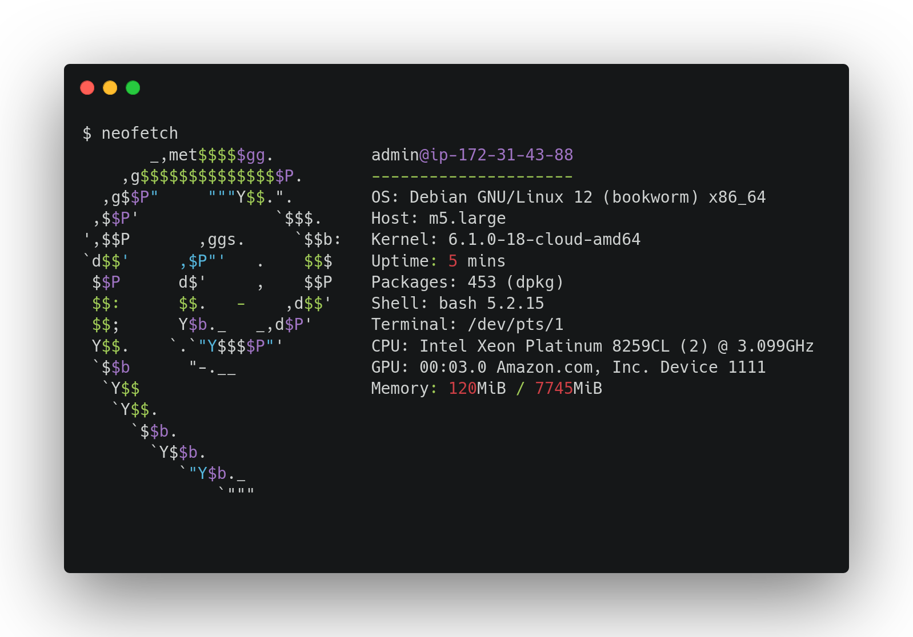
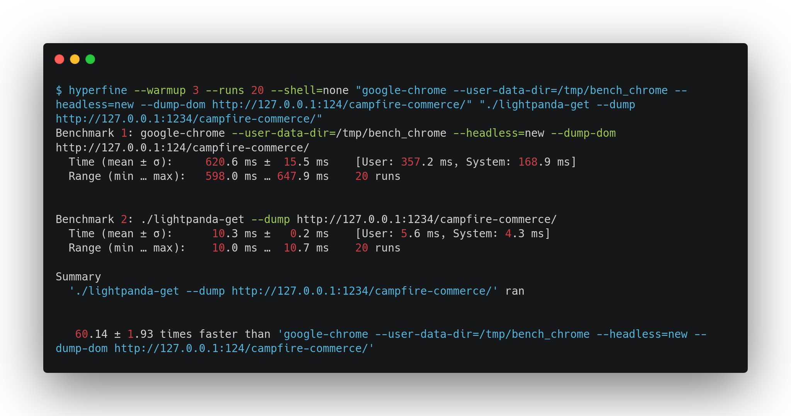

# Benchmark

## Methodology

We all love benchmarks but we know it's difficult to do fair comparisons.
That's why it's important to be very transparent about the protocol of the benchmark.

The benchmark uses a [homemade demo web page](https://github.com/lightpanda-io/demo).
This web page is a fake e-commerce product offer page loading product details
and reviews in JSON with two XHR requests.

We decided to use a homemade page because Lightpanda browser is not yet fully
compliant and we wanted to be sure it would be able to execute the web page
correctly to be comparable with Google Chrome.

Moreover, using this web page allows us to run the test with a local web server,
reducing network request impacts to the bench.

### Metrics and tools

We measure two metrics:
* time of execution with the help of [Hyperfine](https://github.com/sharkdp/hyperfine)
* peaked memory usage with the help of [GNU time](https://www.gnu.org/software/time/)

## Preparation

### Dependencies

To run the benchmark, you have to install
[Hyperfine](https://github.com/sharkdp/hyperfine) and [GNU
time](https://www.gnu.org/software/time/) tools.

We also expose the demo web page locally using a simple Go program, but you
can use another web server if you want to.

On Debian Linux, you can use:
```console
$ apt install time hyperfine
```

You have also to install [Google Chrome](https://www.google.com/chrome/) and
Lightpanda browser, but the code is not publicly available yet.

### Demo web page

Clone the [demo web page](https://github.com/lightpanda-io/demo) and expose the
`public/` directory locally with a web server.

We use the simple Go program to expose the files in `ws/` dir.
By default it exposes the `public` dir using the `1234` port.

```console
$ go run ws/main.go
```

## Single request

This bench is a very basic test to compare the two software.
We start the browser and request the fake web page once with full JS execution. The final DOMTree is
rendered in stdout.

### Test machine

The tests are run in an AWS m5.large (x86_64) with a fresh Debian install.



We use Google Chrome version 122.0.6261.94.

```console
$ google-chrome --version
Google Chrome 122.0.6261.94
```

### Execution time

```console
$ hyperfine --warmup 3 --runs 20 --shell=none "google-chrome --user-data-dir=/tmp/bench_chrome --headless=new --dump-dom http://127.0.0.1:1234/campfire-commerce/" "./browsercore-get --dump http://127.0.0.1:1234/campfire-commerce/"
Benchmark 1: google-chrome --user-data-dir=/tmp/bench_chrome --headless=new --dump-dom http://127.0.0.1:1234/campfire-commerce/
  Time (mean ± σ):     556.7 ms ±  10.2 ms    [User: 360.8 ms, System: 170.6 ms]
  Range (min … max):   538.2 ms … 571.6 ms    20 runs

Benchmark 2: ./browsercore-get --dump http://127.0.0.1:1234/campfire-commerce/
  Time (mean ± σ):       8.6 ms ±   0.2 ms    [User: 5.0 ms, System: 3.2 ms]
  Range (min … max):     8.3 ms …   9.0 ms    20 runs

Summary
  './browsercore-get --dump http://127.0.0.1:1234/campfire-commerce/' ran
   64.48 ± 1.74 times faster than 'google-chrome --user-data-dir=/tmp/bench_chrome --headless=new --dump-dom http://127.0.0.1:1234/campfire-commerce/'
```



### Memory peak

```console
$ /usr/bin/time -v google-chrome --user-data-dir=/tmp/bench_chrome --headless=new --dump-dom http://127.0.0.1:1234/campfire-commerce/
        Command being timed: "google-chrome --user-data-dir=/tmp/bench_chrome --headless=new --dump-dom http://127.0.0.1:1234/campfire-commerce/"
        User time (seconds): 0.38
        System time (seconds): 0.14
        Percent of CPU this job got: 96%
        Elapsed (wall clock) time (h:mm:ss or m:ss): 0:00.55
        Average shared text size (kbytes): 0
        Average unshared data size (kbytes): 0
        Average stack size (kbytes): 0
        Average total size (kbytes): 0
        Maximum resident set size (kbytes): 169924
        Average resident set size (kbytes): 0
        Major (requiring I/O) page faults: 5
        Minor (reclaiming a frame) page faults: 20535
        Voluntary context switches: 2664
        Involuntary context switches: 1655
        Swaps: 0
        File system inputs: 0
        File system outputs: 1624
        Socket messages sent: 0
        Socket messages received: 0
        Signals delivered: 0
        Page size (bytes): 4096
        Exit status: 0
```

```console
$ /usr/bin/time -v ./browsercore-get --dump http://127.0.0.1:1234/campfire-commerce/
        Command being timed: "./browsercore-get --dump http://127.0.0.1:1234/campfire-commerce/"
        User time (seconds): 0.00
        System time (seconds): 0.00
        Percent of CPU this job got: 100%
        Elapsed (wall clock) time (h:mm:ss or m:ss): 0:00.01
        Average shared text size (kbytes): 0
        Average unshared data size (kbytes): 0
        Average stack size (kbytes): 0
        Average total size (kbytes): 0
        Maximum resident set size (kbytes): 14348
        Average resident set size (kbytes): 0
        Major (requiring I/O) page faults: 0
        Minor (reclaiming a frame) page faults: 751
        Voluntary context switches: 6
        Involuntary context switches: 70
        Swaps: 0
        File system inputs: 0
        File system outputs: 0
        Socket messages sent: 0
        Socket messages received: 0
        Signals delivered: 0
        Page size (bytes): 4096
        Exit status: 0
```

## Multiple requests

We plan to create a benchmark to compare the memory used during multiple
successive requests sent to a CDP server.
