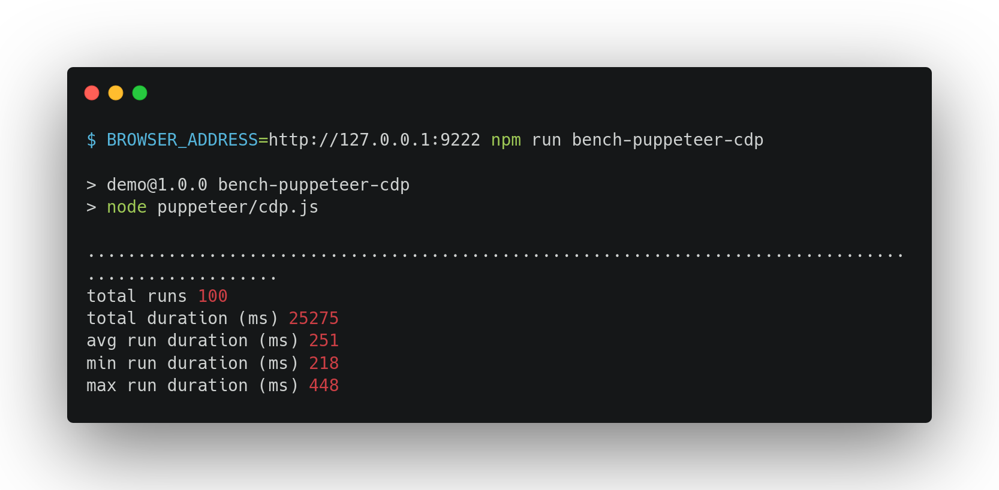

# Benchmark

## Methodology

We all love benchmarks but we know it's difficult to do fair comparisons.
That's why it's important to be very transparent about the protocol of the benchmark.

The benchmark uses a [homemade demo web page](https://github.com/lightpanda-io/demo).
This web page is a fake e-commerce product offer page loading product details
and reviews in JSON with two XHR requests.

We decided to use a homemade page because Lightpanda browser is not yet fully
compliant and we wanted to be sure it would be able to execute the web page
correctly to be comparable with Google Chrome.

Moreover, using this web page allows us to run the test with a local web server,
reducing network request impacts to the bench.

### Metrics and tools

We measure two metrics:
* time of execution with the help of [Hyperfine](https://github.com/sharkdp/hyperfine)
* peaked memory usage with the help of [GNU time](https://www.gnu.org/software/time/)

## Preparation

### Dependencies

To run the benchmark, you have to install
[Hyperfine](https://github.com/sharkdp/hyperfine) and [GNU
time](https://www.gnu.org/software/time/) tools.

We also expose the demo web page locally using a simple Go program, but you
can use another web server if you want to.

On Debian Linux, you can use:
```console
$ apt install time hyperfine
```

You have also to install [Google Chrome](https://www.google.com/chrome/) and
[Lightpanda browser](https://github.com/lightpanda-io/browser/releases/tag/nightly).

### Demo web page

Clone the [demo web page](https://github.com/lightpanda-io/demo) and expose the
`public/` directory locally with a web server.

We use the simple Go program to expose the files in `ws/` dir.
By default it exposes the `public` dir using the `1234` port.

```console
$ go run ws/main.go
```

### Test machine

The tests are run in an AWS m5.large (x86_64) with a fresh Debian install.


## Single request

This bench is a very basic test to compare the two software.
We start the browser and request the fake web page once with full JS execution. The final DOMTree is
rendered in stdout.

We use Google Chrome version 130.0.6723.58.

```console
$ google-chrome --version
Google Chrome 136.0.7103.113
```

And Lightpanda commit [eed3d27](https://github.com/lightpanda-io/browser/commit/eed3d27).

```console
$ ./lightpanda version
eed3d27
```

### Execution time

```console
$ hyperfine --warmup 3 --runs 20 --shell=none "google-chrome --user-data-dir=/tmp/bench_chrome --headless=new --dump-dom http://127.0.0.1:124/campfire-commerce/" "./lightpanda --dump http://127.0.0.1:1234/campfire-commerce/"
Benchmark 1: google-chrome --user-data-dir=/tmp/bench_chrome --headless=new --dump-dom http://127.0.0.1:124/campfire-commerce/
  Time (mean ± σ):     589.8 ms ±   7.5 ms    [User: 353.0 ms, System: 161.5 ms]
  Range (min … max):   575.4 ms … 604.8 ms    20 runs

Benchmark 2: ./lightpanda --dump http://127.0.0.1:1234/campfire-commerce/
  Time (mean ± σ):      37.1 ms ±   1.2 ms    [User: 31.7 ms, System: 6.8 ms]
  Range (min … max):    34.9 ms …  40.9 ms    20 runs

Summary
  './lightpanda --dump http://127.0.0.1:1234/campfire-commerce/' ran
   15.91 ± 0.57 times faster than 'google-chrome --user-data-dir=/tmp/bench_chrome --headless=new --dump-dom http://127.0.0.1:124/campfire-commerce/'
```


### Memory peak

```console
$ /usr/bin/time -v google-chrome --user-data-dir=/tmp/bench_chrome --headless=new --dump-dom http://127.0.0.1:1234/campfire-commerce/
        Command being timed: "google-chrome --user-data-dir=/tmp/bench_chrome --headless=new --dump-dom http://127.0.0.1:1234/campfire-commerce/"
        User time (seconds): 0.36
        System time (seconds): 0.18
        Percent of CPU this job got: 91%
        Elapsed (wall clock) time (h:mm:ss or m:ss): 0:00.60
        Average shared text size (kbytes): 0
        Average unshared data size (kbytes): 0
        Average stack size (kbytes): 0
        Average total size (kbytes): 0
        Maximum resident set size (kbytes): 183212
        Average resident set size (kbytes): 0
        Major (requiring I/O) page faults: 0
        Minor (reclaiming a frame) page faults: 21131
        Voluntary context switches: 3066
        Involuntary context switches: 1548
        Swaps: 0
        File system inputs: 0
        File system outputs: 3488
        Socket messages sent: 0
        Socket messages received: 0
        Signals delivered: 0
        Page size (bytes): 4096
        Exit status: 0
```

```console
$ /usr/bin/time -v ./lightpanda fetch --dump http://127.0.0.1:1234/campfire-commerce/
        Command being timed: "./lightpanda fetch --dump http://127.0.0.1:1234/campfire-commerce/"
        User time (seconds): 0.03
        System time (seconds): 0.01
        Percent of CPU this job got: 100%
        Elapsed (wall clock) time (h:mm:ss or m:ss): 0:00.04
        Average shared text size (kbytes): 0
        Average unshared data size (kbytes): 0
        Average stack size (kbytes): 0
        Average total size (kbytes): 0
        Maximum resident set size (kbytes): 26540
        Average resident set size (kbytes): 0
        Major (requiring I/O) page faults: 0
        Minor (reclaiming a frame) page faults: 1229
        Voluntary context switches: 32
        Involuntary context switches: 827
        Swaps: 0
        File system inputs: 0
        File system outputs: 0
        Socket messages sent: 0
        Socket messages received: 0
        Signals delivered: 0
        Page size (bytes): 4096
        Exit status: 0
```

## Multiple requests using Puppeteer

We compare now multiple page loads and js evaluations using
[Puppeteer](https://https://pptr.dev/), which connects to the browser using CDP
(Chrome Debug Protocol).

### Dependencies

To run the benchmark, you need ti install [nodejs](https://nodejs.org/en/download).

Once `nodejs` is installed, please run a `npm install` to install nodejs
dependencies, mainly Puppeteer.

You have also to install [Google Chrome](https://www.google.com/chrome/) and
Lightpanda browser, but the code is not publicly available yet.

### Running the benchmark

The `puppeteer/cdp.js` benchmark accepts multiple env vars to be configured.
* `BROWSER_ADDRESS` is the address of the running browser listening the CDP protocol, by default `ws://127.0.0.1:9222`.
* `BASE_URL` is the base url of the running web reser to request, by default `http://127.0.0.1:1234`.
* `RUNS` is the number of pages loaded by the benchmark, default is `100`.

`npm run bench-puppeteer-cdp` starts a Puppeteer process
instance and load the page to extract data 100 times.

```console
$ npm run bench-puppeteer-cdp
```

### Results

**Google Chrome**

We use Google Chrome version 130.0.6723.58.

You have to start the browser first.
```console
$ /usr/bin/time -v google-chrome --headless=new --remote-debugging-port=9222
```

Then you can run the benchmark.
```console
$ BROWSER_ADDRESS=http://127.0.0.1:9222 npm run bench-puppeteer-cdp

> demo@1.0.0 bench-puppeteer-cdp
> node puppeteer/cdp.js

................................................................................
....................
total runs 100
total duration (ms) 25275
avg run duration (ms) 251
min run duration (ms) 218
max run duration (ms) 448
```



```console
        Command being timed: "google-chrome --headless=new --remote-debugging-port=9222"
        User time (seconds): 16.38
        System time (seconds): 6.13
        Percent of CPU this job got: 68%
        Elapsed (wall clock) time (h:mm:ss or m:ss): 0:32.78
        Average shared text size (kbytes): 0
        Average unshared data size (kbytes): 0
        Average stack size (kbytes): 0
        Average total size (kbytes): 0
        Maximum resident set size (kbytes): 217020
        Average resident set size (kbytes): 0
        Major (requiring I/O) page faults: 0
        Minor (reclaiming a frame) page faults: 298036
        Voluntary context switches: 171980
        Involuntary context switches: 87943
        Swaps: 0
        File system inputs: 0
        File system outputs: 34680
        Socket messages sent: 0
        Socket messages received: 0
        Signals delivered: 0
        Page size (bytes): 4096
        Exit status: 0
```

**Lightpanda browser**

We use Lightpanda commit [b846541ff69082f4d283155f0b3651ae0394a240](https://github.com/lightpanda-io/browser/commit/b846541ff69082f4d283155f0b3651ae0394a240).

You have to start Lightpanda browser.
```console
/usr/bin/time -v ./lightpanda serve --gc_hints
```

Then you can run the benchmark.
```console
$ npm run bench-puppeteer-cdp

> demo@1.0.0 bench-puppeteer-cdp
> node puppeteer/cdp.js

.
................................................................................
...................
total runs 100
total duration (ms) 2861
avg run duration (ms) 28
min run duration (ms) 24
max run duration (ms) 56
```


```console
        Command being timed: "./lightpanda serve --gc_hints"
        User time (seconds): 2.80
        System time (seconds): 0.29
        Percent of CPU this job got: 50%
        Elapsed (wall clock) time (h:mm:ss or m:ss): 0:06.15
        Average shared text size (kbytes): 0
        Average unshared data size (kbytes): 0
        Average stack size (kbytes): 0
        Average total size (kbytes): 0
        Maximum resident set size (kbytes): 31544
        Average resident set size (kbytes): 0
        Major (requiring I/O) page faults: 0
        Minor (reclaiming a frame) page faults: 42935
        Voluntary context switches: 4588
        Involuntary context switches: 4494
        Swaps: 0
        File system inputs: 0
        File system outputs: 0
        Socket messages sent: 0
        Socket messages received: 0
        Signals delivered: 0
        Page size (bytes): 4096
        Exit status: 0
```

---

Console images generated with [Carbon](https://carbon.now.sh).
